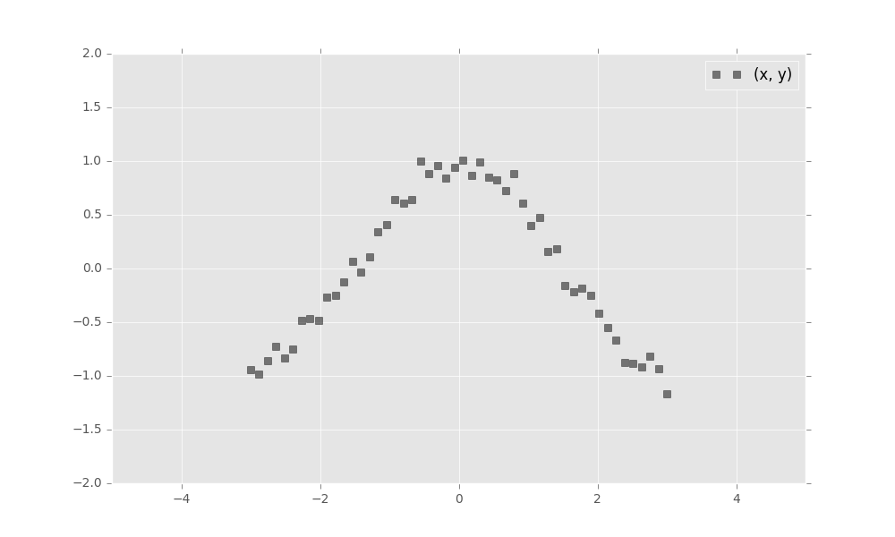
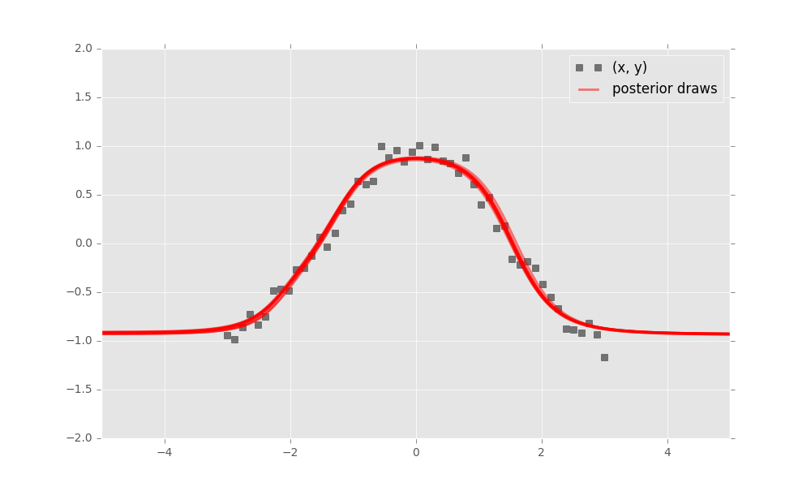

# Edward中文文档

Edward 是一个用于概率建模、推理和评估的 Python 库。它是一个用于快速实验和研究概率模型的测试平台，其涵盖的模型范围从在小数据集上的经典层次模型到在大数据集上的复杂深度概率模型。Edward 融合了以下三个领域：贝叶斯统计学和机器学习、深度学习、概率编程。

它支持以下方式的建模：

- 定向图模型
- 神经网络（通过[Keras](http://keras.io) 和 [TensorFlowSlim](https://github.com/tensorflow/tensorflow/tree/master/tensorflow/contrib/slim)等库）
- 条件特定的无向模型
- 贝叶斯非参数和概率程序

它支持以下方式的推理：

- 变分推理（Variational inference）


- 黑箱变分推理
- 随机变分推理
- 包容 KL 散度（Inclusive KL divergence）
- 最大后验估计

蒙特卡洛（Monte Carlo）

- 哈密尔顿蒙特卡罗（Hamiltonian Monte Carlo）
- 随机梯度 Langevin 动态
- Metropolis-Hastings

推理的组成

- 期望最大化（Expectation-Maximization）
- 伪边界和 ABC 方法（Pseudo-marginal and ABC methods）
- 消息传递算法（Message passing algorithms）

它支持以下的模型评估和推理

- 基于点的评估（Point-based evaluations）
- 后验预测检查（Posterior predictive checks）

同时，由于Edward 构建于TensorFlow之上。它支持诸如计算图、分布式训练、CPU/GPU 集成、自动微分等功能，也可以用 TensorBoard 可视化。

## 关于Edward-cn

目前文档还未全部完成（仅仅是开了一个头）。

由于作者水平和研究方向所限，无法对所有模块都非常精通，因此文档中不可避免的会出现各种错误、疏漏和不足之处。如果您在使用过程中有任何意见、建议和疑问，欢迎发送邮件到chengzehua@outlook.com与我取得联系。

您对文档的任何贡献，包括文档的翻译、查缺补漏、概念解释、发现和修改问题、贡献示例程序等，均会被记录，稍后将开放“致谢”，十分感谢您对Edward中文文档的贡献！

## 我们开始吧！

### 安装

```
pip install edward
```

Edward中的概率建模使用简单的随机变量。 这里我们将展示一个贝叶斯神经网络。 它是一个神经网络，其重量具有先前的分布。

```python
import numpy as np

x_train = np.linspace(-3, 3, num=50)
y_train = np.cos(x_train) + np.random.normal(0, 0.1, size=50)
x_train = x_train.astype(np.float32).reshape((50, 1))
y_train = y_train.astype(np.float32).reshape((50, 1))
```



接下来，定义一个双层贝叶斯神经网络。 在这里，我们用`tanh`非线性手动定义神经网络。

```python
import tensorflow as tf
from edward.models import Normal

W_0 = Normal(mu=tf.zeros([1, 2]), sigma=tf.ones([1, 2]))
W_1 = Normal(mu=tf.zeros([2, 1]), sigma=tf.ones([2, 1]))
b_0 = Normal(mu=tf.zeros(2), sigma=tf.ones(2))
b_1 = Normal(mu=tf.zeros(1), sigma=tf.ones(1))

x = x_train
y = Normal(mu=tf.matmul(tf.tanh(tf.matmul(x, W_0) + b_0), W_1) + b_1,
           sigma=0.1)
```

接下来，从数据中推断出模型。 我们将使用变分推理。 指定权重和偏差之间的正态逼近。

```python
qW_0 = Normal(mu=tf.Variable(tf.zeros([1, 2])),
              sigma=tf.nn.softplus(tf.Variable(tf.zeros([1, 2]))))
qW_1 = Normal(mu=tf.Variable(tf.zeros([2, 1])),
              sigma=tf.nn.softplus(tf.Variable(tf.zeros([2, 1]))))
qb_0 = Normal(mu=tf.Variable(tf.zeros(2)),
              sigma=tf.nn.softplus(tf.Variable(tf.zeros(2))))
qb_1 = Normal(mu=tf.Variable(tf.zeros(1)),
              sigma=tf.nn.softplus(tf.Variable(tf.zeros(1))))
```

定义tf.Variable允许变量因子的参数变化。 它们都被初始化为0。根据[softplus](https://en.wikipedia.org/wiki/Rectifier_(neural_networks))变换，标准偏差参数被约束为大于零。

现在，使用[相对熵](https://en.wikipedia.org/wiki/Kullback%E2%80%93Leibler_divergence)运行变分推理，以推断模型的潜在变量给定的数据。 我们指定`1000`次迭代。

```python
import edward as ed

inference = ed.KLqp({W_0: qW_0, b_0: qb_0,
                     W_1: qW_1, b_1: qb_1}, data={y: y_train})
inference.run(n_iter=500)
```

最后来评价一下模型。 贝叶斯神经网络定义了神经网络的分布，因此我们可以执行图形检查。将结果直接用可视化的方式来呈现。



## 注

欢迎有能力的小伙伴参加研究(chengzehua@outlook.com)。

## Resources

- [Edward website](http://edwardlib.org)
- [Edward Forum](http://discuss.edwardlib.org)
- [Edward Gitter channel](http://gitter.im/blei-lab/edward)
- [Edward releases](https://github.com/blei-lab/edward/releases)
- [Edward papers, posters, and slides](https://github.com/edwardlib/papers)